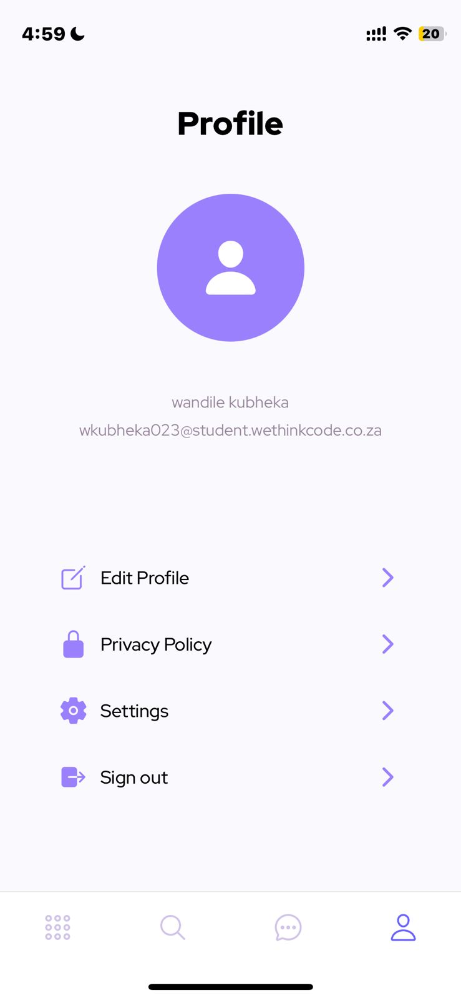
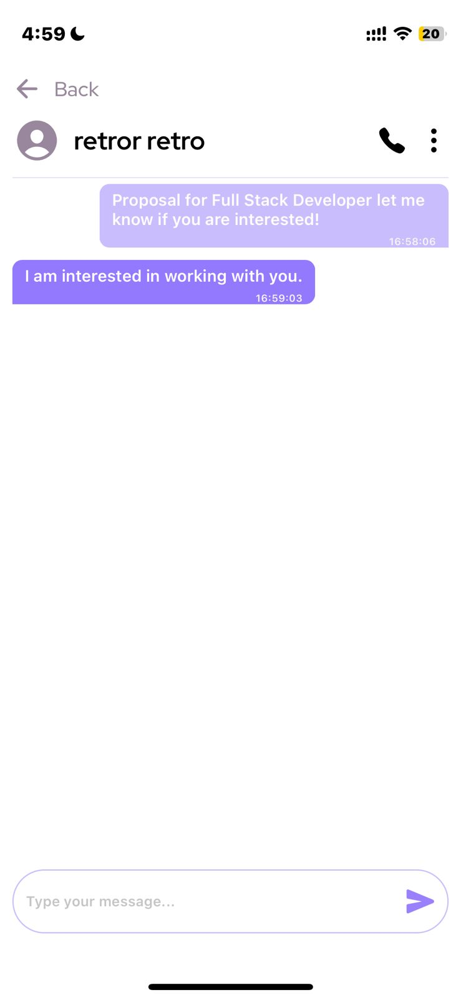
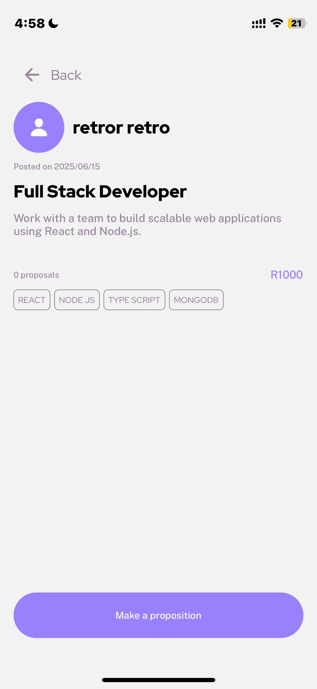
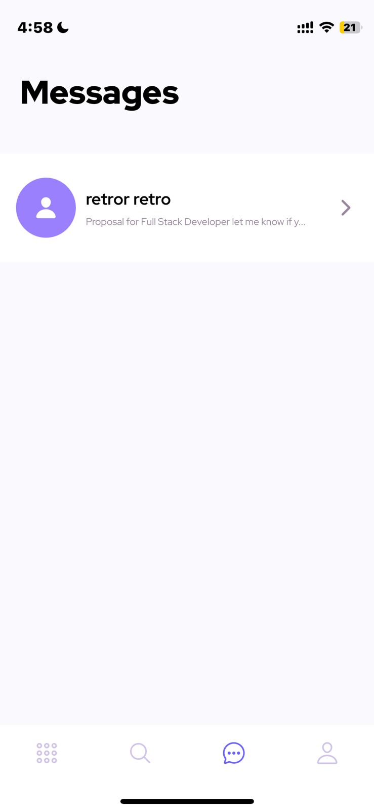
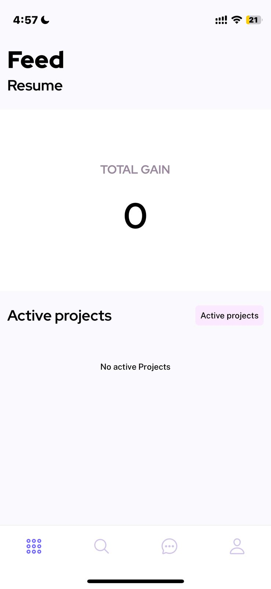
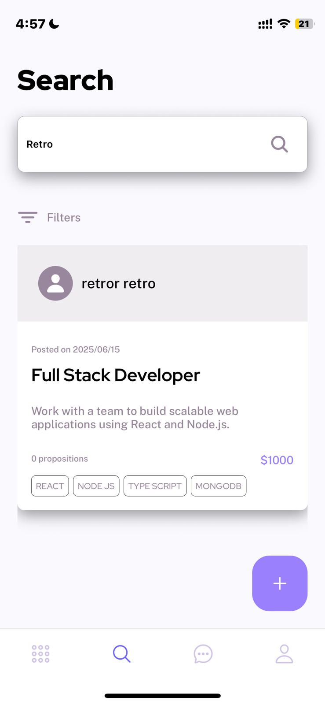
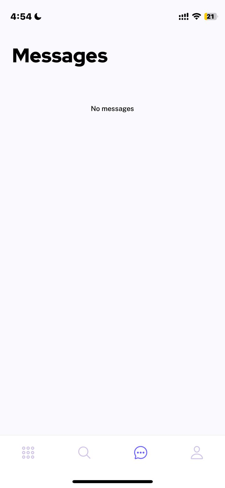
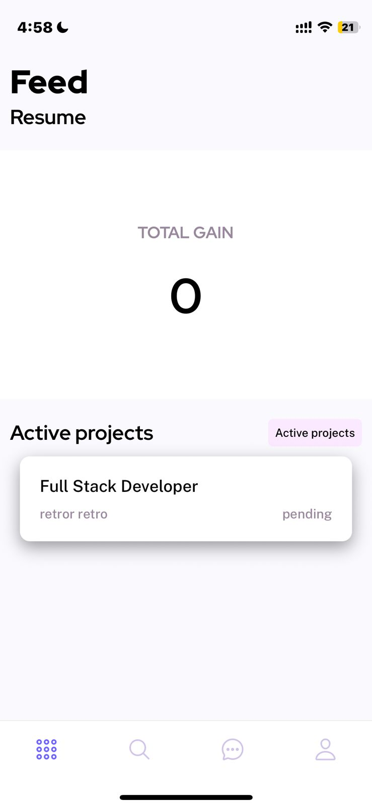
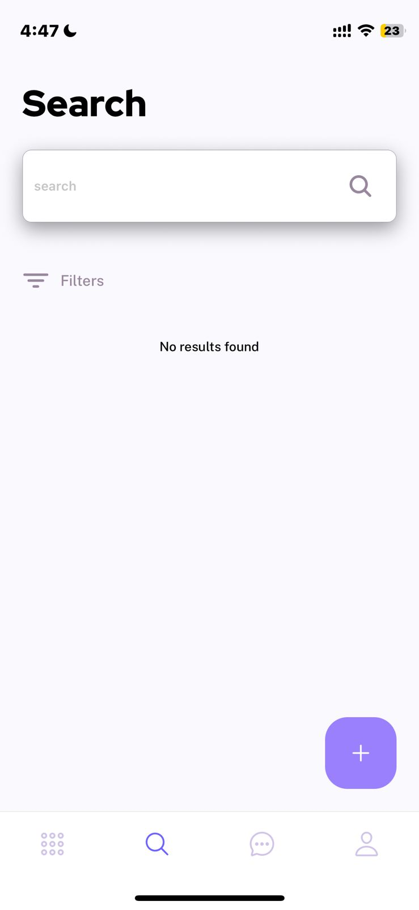

# 📱 SPICE - React Native App

## 📸 Screenshots

### Messages Screen














---

**SPICE** is a mobile application built with React Native where users can **offer services**, **accept service offers**, **communicate via built-in chat**, and **track the progress of their tasks** in real time.

## ✨ Features

- 🔄 **Service Exchange**: Users can list services to offer or browse available services.
- 💬 **Real-time Chat**: Each service transaction includes a chat to keep users connected.
- 📊 **Task Progress Tracking**: Track the current status and completion of a service/task.
- 👤 **User Profiles**: Manage personal info and services offered.
- 🔍 **Search Services**: Discover available services by category, name, or location.

## 📁 Project Structure

```
SPICE/
├── app/                  # App entry point and root navigation
├── assets/               # Static assets (images, fonts, etc.)
├── components/           # Shared reusable components
├── constants/            # App-wide constants and configurations
├── features/             # Feature-specific modules
│   ├── auth/             # Authentication (login, register)
│   │   ├── components/   # Auth-related components
│   │   ├── data/         # Static or local auth data
│   │   ├── hooks/        # Auth hooks
│   │   └── service/      # Auth services (e.g., login, register)
│   ├── detail/           # Service detail view
│   ├── home/             # Home screen and feed
│   ├── messages/         # Chat and messaging logic
│   ├── profile/          # User profile and settings
│   └── search/           # Search functionality
├── service/              # External service handlers (e.g., Firebase)
├── store/                # Global state management
│   └── useUserStore.ts   # User state store
├── utils/                # Helper functions and validators
│   ├── formValidator.ts
│   └── prefixToKey.ts
├── @types/               # Global TypeScript types
├── .env                  # Environment variables
├── app.json              # Expo config
├── firebase.js           # Firebase initialization
├── .gitignore
├── expo-env.d.ts
```

## 🛠️ Tech Stack

- **React Native (Expo)**
- **TypeScript**
- **Firebase** (Authentication, Firestore, Storage)
- **Zustand** for state management
- **React Navigation** for routing

## 🚀 Getting Started

### 1. Clone the Repository

```bash
git clone https://github.com/Wandilekubheka/spice-app.git
cd spice-app
```

### 2. Install Dependencies

```bash
npm install
# or
yarn install
```

### 3. Setup Environment Variables

Create a `.env` file in the root of the project and add your Firebase credentials:

```
API_KEY=your_api_key
AUTH_DOMAIN=your_project.firebaseapp.com
PROJECT_ID=your_project_id
STORAGE_BUCKET=your_project.appspot.com
MESSAGING_SENDER_ID=your_sender_id
APP_ID=your_app_id
```

### 4. Start the App

```bash
npx expo start
```

## 🧪 Development Tips

- Organize feature logic under `features/` using a modular structure.
- Reuse UI blocks by placing them in `components/`.
- Use `store/useUserStore.ts` to manage global user state.
- Place reusable utilities like validators in `utils/`.

## 📄 License

MIT License. Feel free to use, modify, and contribute.
